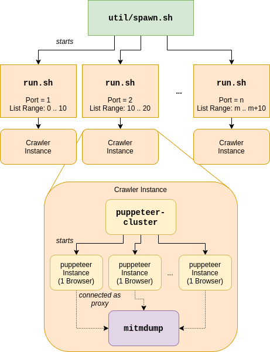

# WebAssembly Web Crawler 

Web Crawler for collecting WebAssembly modules and related JavaScript files. The code is based on the original repository found at https://github.com/Shopify/wasm-bench. It has been built using `puppeteer-cluster` and `mitmproxy`. The WebAssembly binaries extracted from this will be used in my master's thesis project.

## Installing Dependencies

To install the necessary dependencies, run the command `make install`. This will install the required node modules and download a specific version of `mitmproxy`. The required binary will then be extracted into the `./bin` folder.

## Running

The crawler can be run using the command `./run.sh`. To see the available options, run `./run.sh --help`. Please note that the `mitmdump` processes tend to grow in size over time, and the crawler may need to be restarted regularly to prevent memory leaks  ([may be related - mitmdump leaking memory](https://github.com/mitmproxy/mitmproxy/issues/3191#issuecomment-552911587)). Consider installing a newer version of `mitmproxy` to resolve the issue and move the binary to `./bin`. 

## Architecture

A single crawler instance consists of one `puppeteer-cluster` process, which
controls the navigation to different web pages (by default, 8 at a time), 
and one `mitmproxy` instance, which intercepts the requests made my puppeteer
and searches for Wasm modules.  
We experienced issues which we suspected to be related to limited throughput
of the python script that evaluates sent requests and responses; Thus, we use `util/spawn.sh` to spawn multiple of these crawler instances at the same time -- see the
image below:

